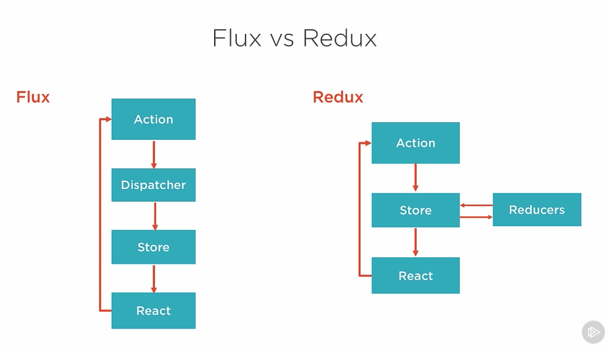

# react~redux

## Intro

### Why Redux
    - Helps with complex data flows, components etc
    - When there are many actions
    - When same data in multiple places

### Three core principles
- Single immutable store
- Actions only way to trigger state changes
- Reduceres (pure functions) change state

### Flux vs Redux
#### Similarities
- Unidirectional data flow
- Actions trigger state change
- Stores holds states

#### Differences
- Reducers
- Containers react components contain logic to marshall data/actions around through props
- Immutability of state
- Store and change logic (reducers) are separate, in flux they were handled by store
- Flux can have multiple flat/disconnected stores
- No dispatcher in redux, reducers
- With `react-redux` library components don't have to subscribe to stores

## Getting warmer

### Actions
- plain object of this structure `{ type: ACTION_NAME, someprop: action data }`
- Action creators are convinence functions that create actions

### Store
- Single store, single truth
- Created on application entry point
- You pass store to reducers
- Main APIs
    - `store.dispatch(action)`
    - `store.subscribe(listener)`
    - `store.getState()`
    - `replaceReducer(nextReducer)`
        Helps with hot reloading!
- No API to directly change state!
- `createStore(rootReducer, initialState, applyMiddleware(...,...)`

### Immutability
- To change object, return new object
- JS supports immutability already for following types
    - number
    - string
    - bool
    - undefined
    - null
- Mutable objects in JS are
    - objects
    - Arrays
    - Functions
- Don't have to manually create a copy instead use native functions (ES6)
    - `Object.assign(target, ...sources)`  
    Example: `Object.assign({}, state, { role: 'admin' });`
- Clarity  
    When state is changed we know where and how it changed
- Performance
    - With mutability redux has to check all properties to see whether state
    changed
    - With react-redux we can just check whether reference changed
- Debugging
    - Time travelling debugging!
    - Undo/Redo of operations why debugging
    - Ability to turn off individual actions
    - Play interactions back

#### Handling Immutability
ES6
- Object.assign
- Spread Operator

ES5
- Lodash merge
- Lodash extend
- Object-assign

Libraries
- react-addons-update
- Immutable.js

Enfore immutability
- Education/Trust
- Library `redux-immutable-state-invariant` warns when state changes
- Immutable.js from Fb

### Reducer
- `(state, action) => state`
- Reducers must be pure functions
- Forbidden
    - Mutate arguments
    - Perform side effects
    - Call non-pure functions
- Each reducer handles it's slice of state. Reducers are passed only the state
  it can modify.
- Reducer composition (Check [Redux
  FAQ](https://redux.js.org/docs/faq/Actions.html#is-there-always-a-one-to-one-mapping-between-reducers-and-actions))

## Components
### Container (Smart)
- Focus on how things work
- Aware of redux and subscribes to redux state
- Dispatches redux actions
- Generated by react-redux, not hand wrung generally

### Presentational (Dumb)
- Focuses on how things look
- Unaware of redux
- Reads data from props
- Invoke callbacks on props
- Written by hand

## react-redux
### Provider Component
- Attaches app to store
- Use it to wrap your top level component
- Don't have to explicitly passed, available as part of React's context

### Connect Component
- Wraps our components so it's connected to the redux store
- Creates container components
- Benefits
    - No boilerplate to subscribe/unsubscribe
    - No lifecycle methods requried so is stateless and easy to manage
    - Declare subset of state that's needed instead of exposing whole stores
    - Enhanced perf due to ^
- API methods
    - `mapStateToProps`
        - Best place to filter what states to expose
        - If performing expensive operations, use `Reselect` library for
          memoizing (don't call func if calling with same parameters)
    - `mapDispatchToProps`
        - What actions to expose to components
        - `bindActionCreators` method to pass 
        - 3 ways to handle `mapDispatchToProps`
            - Ignore it, use dispatch
                - Requires boilerplate
                - Child components needs to be aware of redux
            - Manually wrap
                - Clear what you are doing
                - Lots of redundancy
            - `bindActionCreators` does ^ automatically

## Mock API Dev Pattern
- Helps you start before API exists
- Independece (to develop and deploy)
- Backup plan (if APIs are broken, doesn't stop your devs)
- Ultra-fast (instantanious responses)
- Test behaviour under latency (as we can delay responses by using `setTimeout`)
- Aids testing (as responses are deterministic you can test with data)
- Easily switch between Mock/reala API by pointing to them or changing
  configuration

## Asyc in Redux
### redux-thunk
- Return functions from action creators
- Clunky to test
- Easy to learn
### redux-saga
- Uses ES6 generators and rich domain specific language
- Pause and resume later
- Multiple `yield` statements
- Easy to test
- Hard to learn (subtle bugs)
### redux-promise
- Flux standard actions and promises

> Thunk: A function that wraps a expression to delay it's execution.
