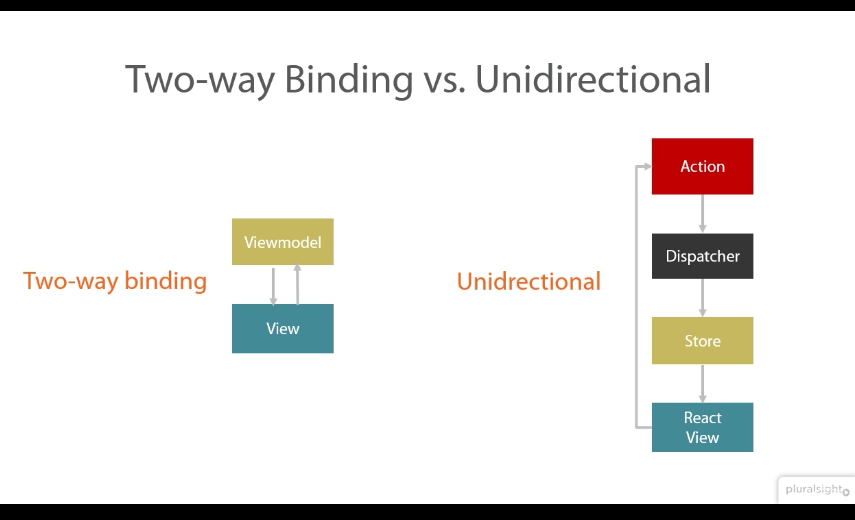

# react - *deeper dive (intermediate)*

## Data
react component data is held in 
* `props`

   - short for properties  
   - think of it as HTML attributes
   - immutable  
   - passed from parent to child  
   - owned by parent  
   - `getDefaultProps` method to set default props for component to prevent issues when
     parent doesn't set them.

* `state`

   - mutable  
   - only use in top-level components  
   - pass state to child as `props`  
   - `getInitialState` function to set state. Must only be done on the top level
   component also called __ControllerView__.  
   
## Lifecyle

Lifecyle methods are available to wire components. Some are __isomorphic__, ie,
will get fired on client as well as server.
- `componentWillMount`  
   Fires before initial render, both server and client (isomorphic)  
   Good spot to set *initial state*  
- `componentDidMount`  
   Immideately after render  
   Useful for accessing DOM, integrating with frameworks, set times and AJAX
   requests.  
   `isMounted()` method to check whether component has been mounted.
- `componentWillReceiveProps`  
   Fires before receiving new properties (or changed properties)  
   Doesn't fire on initial render (useful!)  
   Helps to set state before a render (not the initial one)  
- `shouldComponentUpdate`  
   Before render when new props/state has been received  
   Not on initial render (useful!)  
   Return `false` to avoid unnecessary re-renders  
   Helps improve performance  
- `componentWillUpdate`  
   Just after render  
   Can't set state here (obviously)  
- `componentDidUpdate`  
   Immediately after updates are *flushed* to the DOM  
   Place to work with DOM after update  
- `componentWillUnmount`  
   Just before removing component from DOM  
   Good place to cleanup/distroy any assets that were created with the
   component.

__Note:__ `key` attribute is required for dynamically generated child elements.
This is used by _react_ to properly reorder or destroy child components.

## Composition

### Component Views

- Any component that has child components
- Controls data flows for child components through props
- Interacts with stores

__Recommendations__  
- Single component view at the very top of the page
- No nested component views as that causes multiple data updates and render
  method to be called multiple times.

### `propTypes`
- Prop validation doesn't run in prod (minified) mode of react
- Explicit about the prop expected in the component
- Can specify data types (`React.PropTypes.array.isRequires`) and whether a property `isRequired`
- If property not required, make sure to set default in `getDefaultProps`
  method

### Mixins
Helps share behaviors amoung multiple components.

## react-router

- Nested views map to nested routes
- Declaratively specify routes
- JSX type syntax
- If path not specified, name is considered path
- Use `<RouteHandler />` to specify where route component will be injected.
- Url parameters and query strings will be available using `props.params`,
  `props.query` and `props.path`

### Links
- Avoids __postback__
- Normalizes all the links we use in an app
- Abstraction over anchors
- Lets you access routes by name so that you don't have to define it to link to
  a page

URL: `/user/1`  
Route: `<route name="user" path="/user/:userId" />`  
JSX: `<Link to="user" params={{userId:1}}>Rohit Nair</Link>`  
Output: `<a hreaf="/user/1">Rohit Nair </a>`  

### Redirects
`<Redirect from="url-from" to="url-to" />`

### Transitions
- `willTransitionTo`  
Determines if needs to transition to a page  
``` 
statics: {
    willTransitionTo: function(transition, params, query, callback) {

    }
}
```
- `willTransitionFrom`  
Fires before transitioning and a good place to run validate or prompt user.
``` 
statics: {
    willTransitionFrom: function(transition, component {

    }
}
```

### Locations
__Hash Location__  
- Locations specified by `#` in front [foo.com#/bar](foo.com#/bar)  
- Ugly URLs  
- Works on all browsers  
- Not compatible with server rendering  

__History Location__  
- New HTML5 API  
- Clean URLs [foo.com/bar](foo.com/bar)  
- Support only for IE10+ and also missing from some other older stock brosers.
(95% support in the wild)  
- Works with server-render  

## Forms
- Maintain state in ControllerView at a parent level and pass state as props
- Further wire `onChange` and other events by passing handlers as props
- Use `componentWillMount` event to populate form as it happens before
  render and hence prevents re-render
- Can pass state as url paramets and use `props.params` property to set state
  of the component
- Register router with transition to as `student/:id` to pass student id as url
  parameter and be available in transitioned page. Use `Link` to perform
  transitions.
- Implement validation by maintaining errors as state and passing it around as
  props.

## Flux
- A pattern for unidierectional data flow
- Centralized dispatcher



### 3 core flux concepts
- Action: Describe user interaction in react component  
    - Encapsulates app events
    - Dispatchers exposes a method to trigger a dispatch to store with a
      payload of data which is called action
    - Action creaters are dispatcher helper methods which show all the actions
      available
    - Actions are triggered two places, user interaction, from server(page
      load, errors etc)
    - Action creators add types stored in constants file
    - Action payload has following properties `{ actionType: <TYPE>, data: { ... }`
- Dispatcher: Singleton registry (centralized list of callbacks)  
    - All data flows through dispatcher,
    - Singleton so only one dispatcher per app
    - Dispatches action to stores, 
    - stores registers callbacks for actions
    - Makes application predictable
    - Only stores should register callbacks with dispatcher
- Store: Holds application data and reflects in UI
    - Holds app state, logic and data retrieval
    - Not a model as in MVC but contains models
    - App can have single or multiple stores
    - Uses Node's `EventEmitter` to let React View that app state has changed
    - No setter methods
    - Structure
        - Extend `EventEmitter`
        - Expose `addChangeListner` and `removeChangeListner`
        - Method to `emitChange`
- React View: UI

> As an application grows, the dispatcher becomes more vital, as it can be used
> to __manage dependencies between the stores__ by invoking the registered callbacks in a specific order. Stores can declaratively wait for other stores to finish updating, and then update themselves accordingly.

#### Constants
Keeps things organized
Good place to see what app actually does

#### Flux API
- `register(function callback)`: store registers callback with dispatcher
- `unregister(string id)`: store unregisters callback
- `waitFor(array<string> ids)`: store specifies the order in which store should
  update
- `dispatch(object payload)`: action calls this method with an object that
  needs to be sent to stores
- `isDispatching()`: whether in middle of dispatching

#### Flux vs Pub-Sub (Quite different)
- Callbacks not subscribed to particular event (every payload is dispatched to
  all registered callbacks)
- Callbacks can be differed in whole or partially until other callbacks are executed.

### Packages used
lodash  
keymirror  
object-assign  

